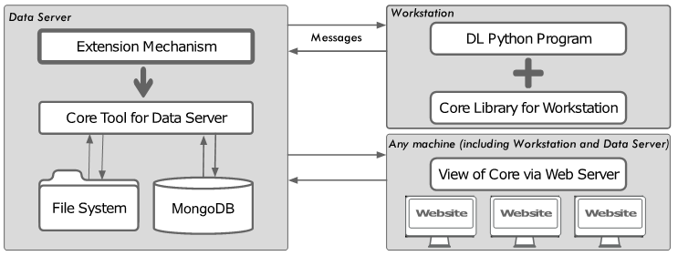

# LDM
DL Lifecycle Data Management Framework.
A framework for capturing all relevant events and artefacts during the DL training process, 
as well as a web interface for inspecting them.
 
##	DL Lifecycle Data Management Framework: General Structure

The general structure of our DL Lifecycle Data Management Framework (LDM framework) is presented in a figure below. 



LDM framework consists of two components:
1.	Core platform, which includes:
    - Core tool which works on Data Server 
    - Core library which is placed on Workstation. Detailed description of this library can be found [here](./python_client_library/README.md). 

  
    The most important features of the Core platform are:
    - to create a new project (ordered set of runs)
    - to add training data sets (training data set, test data set) to this project
    - to create a run belonging to the project
    - to record the progress of an ongoing run (create log entries and save run metadata)
    - to save files used in the run

2.	Core extension mechanism which in fact ensures the development of DSL tool for the given DL lifecycle data management. Core extension mechanism is still under development, therefore it is not shown in this repo yet.


## How to run with docker-compose:
 
 Probably, the easiest way to run LDM framework locally is to use docker-compose and provided docker-compose.yml file.
 To do that you need to clone this repo and have docker and docker-compose installed on your machine. After that you just navigate to the root of the cloned repo and from there execute the following comands:
 
``` bash
docker-compose build
docker-compose up
```
If the execution of above mentioned commands is successful - the framework is ready.  You should now be able to point your browser to http://localhost:8000 and see the system in action.

## How to run without docker:
 It is possible to run LDM framework locally without using docker and docker-compose as well. 
 LDM framework consists of 3 parts: Mongo DB service, back-end service and front-end service. As a consequnce to start the framework without docker you just need to start these 3 services "manually". Mongo DB service needs to be started in a usual way. Instructions on how to start back-end and front-end services can be found in the appropriate folders [front-end](./front_end_sbadmin/README.md) and [back-end](./flask_back_end/README.md). 
 
## Tutorial:
 
 [LDM framework quick start](./docs/Tutorial/README.md)
